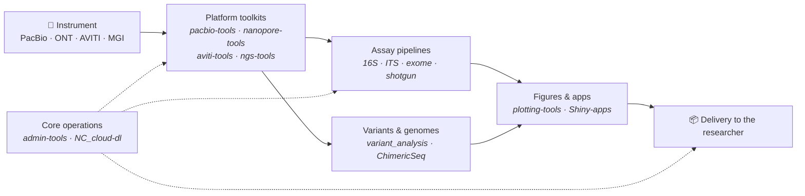

# VIB Nucleomics Core

**Sequencing, analysis, and the code in between.**

We run long- and short-read sequencing for the VIB research community and build the
pipelines, toolboxes, and web tools that turn raw instrument output into answers.
This organization holds that code — from one-line `awk` helpers to containerised
Nextflow pipelines.

---

## Start here

You almost certainly arrived holding data. Find the row that matches it.

| You have… | Start with | Then reach for |
|---|---|---|
| PacBio Revio / Kinnex HiFi reads | [pacbio-tools](https://github.com/Nucleomics-VIB/pacbio-tools) | [Kinnex_16S_decat_demux_bash](https://github.com/Nucleomics-VIB/Kinnex_16S_decat_demux_bash) → [NC_HiFi-16S-workflow](https://github.com/Nucleomics-VIB/NC_HiFi-16S-workflow) |
| Oxford Nanopore reads | [nanopore-tools](https://github.com/Nucleomics-VIB/nanopore-tools) | [ngs-tools](https://github.com/Nucleomics-VIB/ngs-tools) |
| Element **AVITI** output | [aviti-tools](https://github.com/Nucleomics-VIB/aviti-tools) | [variant_analysis](https://github.com/Nucleomics-VIB/variant_analysis) |
| Full-length **16S** amplicons | [NC_HiFi-16S-workflow](https://github.com/Nucleomics-VIB/NC_HiFi-16S-workflow) | [benchmarks](https://github.com/Nucleomics-VIB/benchmarks) |
| Fungal / eukaryote **ITS** amplicons | [NC_NextITS](https://github.com/Nucleomics-VIB/NC_NextITS) | — |
| Bulk RNA-seq (BRB-seq) | [BRBseq-tools](https://github.com/Nucleomics-VIB/BRBseq-tools) | — |
| A plot to make or an app to share | [plotting-tools](https://github.com/Nucleomics-VIB/plotting-tools) | [Shiny-apps](https://github.com/Nucleomics-VIB/Shiny-apps) |
| A server to wrangle, files to move | [admin-tools](https://github.com/Nucleomics-VIB/admin-tools) | [NC_cloud-dl](https://github.com/Nucleomics-VIB/NC_cloud-dl) |

## How the code fits together

Platform toolkits do the demultiplexing and QC that every project needs. Assay
pipelines take it from there. Reporting code is deliberately separate, so the same
figures can be regenerated years later.

## Families

Each family has its own index with a repo-by-repo breakdown.

| Family | What lives there | Index |
|---|---|---|
| 🧪 **Sequencing platform toolkits** | Per-instrument toolboxes: demultiplexing, QC, run parsing, format wrangling | [browse →](https://github.com/Nucleomics-VIB/.github/blob/main/profile/families/sequencing-platforms.md) |
| 🦠 **Amplicon & metabarcoding** | 16S, ITS and Kinnex pipelines from raw reads to taxonomy tables | [browse →](https://github.com/Nucleomics-VIB/.github/blob/main/profile/families/amplicon-metabarcoding.md) |
| 🧫 **Genomes & variants** | Variant calling, assembly QC, chimera and transcript analysis | [browse →](https://github.com/Nucleomics-VIB/.github/blob/main/profile/families/genomes-variants.md) |
| 📊 **Visualization & reporting** | Publication-quality figures, interactive Shiny apps, method benchmarks | [browse →](https://github.com/Nucleomics-VIB/.github/blob/main/profile/families/visualization-reporting.md) |
| ⚙️ **Core operations** | Sysadmin helpers, data movement, day-to-day glue | [browse →](https://github.com/Nucleomics-VIB/.github/blob/main/profile/families/core-operations.md) |
| 🏛️ **Legacy & reference** | Stable, still-cited, no longer actively developed | [browse →](https://github.com/Nucleomics-VIB/.github/blob/main/profile/families/legacy.md) |

Prefer to browse rather than be routed?
**[All repositories, sorted by latest activity →](https://github.com/orgs/Nucleomics-VIB/repositories?sort=updated)**

## Reading a repo name

Our names are a convention, not an accident. Once you know the prefix, you know
what you are looking at:

| Pattern | Meaning | Example |
|---|---|---|
| `*-tools` | A toolbox of many small, independent scripts for one platform or domain | `pacbio-tools` |
| `NC_*` | A Core-operated pipeline or application — production-facing, versioned | `NC_HiFi-16S-workflow` |
| `*_docker` / `*_nf` | A containerised or Nextflow implementation of a sibling pipeline | `NC_HiFi-16S-workflow_docker` |
| `dev_wt_*` | An internal web tool under development | *(internal)* |
| `wbt_*` | A deployed internal web tool | *(internal)* |

## Filter by topic

Every repository carries topics on four axes. These are curated, not guessed — filtering
on one gives you a real shortlist:

| Axis | Pick one | |
|---|---|---|
| **Platform** | [pacbio](https://github.com/orgs/Nucleomics-VIB/repositories?q=topic%3Apacbio) · [nanopore](https://github.com/orgs/Nucleomics-VIB/repositories?q=topic%3Ananopore) · [aviti](https://github.com/orgs/Nucleomics-VIB/repositories?q=topic%3Aaviti) · [mgi](https://github.com/orgs/Nucleomics-VIB/repositories?q=topic%3Amgi) | which instrument made the data |
| **Assay** | [16s](https://github.com/orgs/Nucleomics-VIB/repositories?q=topic%3A16s) · [its](https://github.com/orgs/Nucleomics-VIB/repositories?q=topic%3Aits) · [amplicon](https://github.com/orgs/Nucleomics-VIB/repositories?q=topic%3Aamplicon) · [shotgun](https://github.com/orgs/Nucleomics-VIB/repositories?q=topic%3Ashotgun) · [rnaseq](https://github.com/orgs/Nucleomics-VIB/repositories?q=topic%3Arnaseq) · [assembly](https://github.com/orgs/Nucleomics-VIB/repositories?q=topic%3Aassembly) · [variant-calling](https://github.com/orgs/Nucleomics-VIB/repositories?q=topic%3Avariant-calling) | what was done to it |
| **Shape** | [pipeline](https://github.com/orgs/Nucleomics-VIB/repositories?q=topic%3Apipeline) · [toolbox](https://github.com/orgs/Nucleomics-VIB/repositories?q=topic%3Atoolbox) · [container](https://github.com/orgs/Nucleomics-VIB/repositories?q=topic%3Acontainer) · [shiny-app](https://github.com/orgs/Nucleomics-VIB/repositories?q=topic%3Ashiny-app) · [visualization](https://github.com/orgs/Nucleomics-VIB/repositories?q=topic%3Avisualization) · [benchmark](https://github.com/orgs/Nucleomics-VIB/repositories?q=topic%3Abenchmark) | what kind of thing it is |
| **Lifecycle** | [legacy](https://github.com/orgs/Nucleomics-VIB/repositories?q=topic%3Alegacy) | stable, no longer developed |

Language topics (`bash`, `python`, `r`, `nextflow`) are there too, but they describe how
it is written rather than what it does.

> **A note on what you can see.** A good part of the Core's code is internal:
> LIMS-adjacent web tools, instrument dashboards, pricing calculators, and
> infrastructure that only makes sense inside our network. Those repos are private
> and deliberately absent from this page. Everything indexed here is public and
> usable outside VIB.

## Using our code

Our code is licensed **[GPL-3.0](https://www.gnu.org/licenses/gpl-3.0)**: use it, adapt it,
redistribute it — credit **VIB Nucleomics Core** and licence derived work under the same
terms. Documentation and tutorial repos carry
**[CC BY-SA 4.0](https://creativecommons.org/licenses/by-sa/4.0/)** instead, and each repo's
`LICENSE` is authoritative — the few repos forked from upstream projects keep the upstream
licence. Everything was relicensed on 2026-08-27 from CC BY-SA 3.0, which no licence scanner
could read and which Creative Commons does not recommend for source code; copies obtained
before that date remain available under the old terms.

The code is written to be read, mostly Bash and R with comments rather than frameworks. A few
caveats before you clone:

- **Pipelines assume our reference layout.** Paths and reference genome locations are
  usually configurable at the top of the script; check there first.
- **Container images beat manual installs.** Where a `_docker` sibling exists, use it.
- **Issues are welcome**, including from outside VIB. We read them.

## Credits

Created and maintained by **Stephane Plaisance** — **VIB Nucleomics Core**.

Contributions from the Core's bioinformatics and lab teams across the repos listed above.

Org profile v1.2.0 · 2026-08-27 · <a href="https://www.nucleomics.be">nucleomics.be</a>
